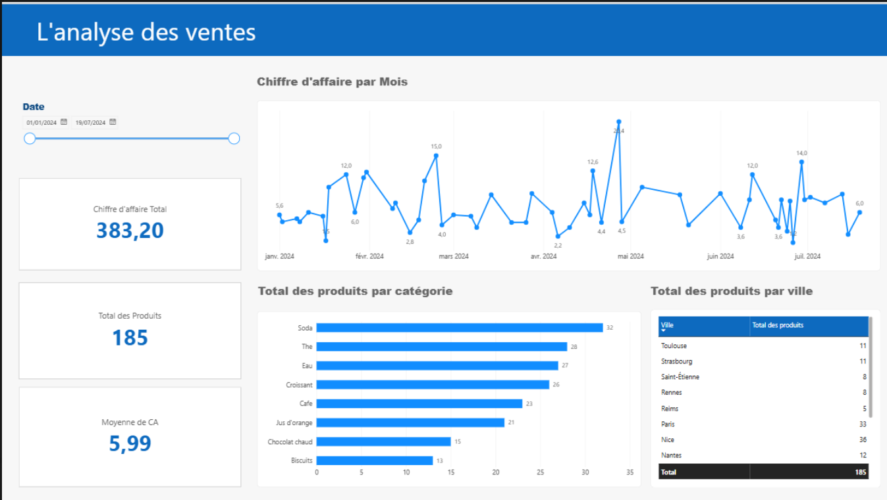
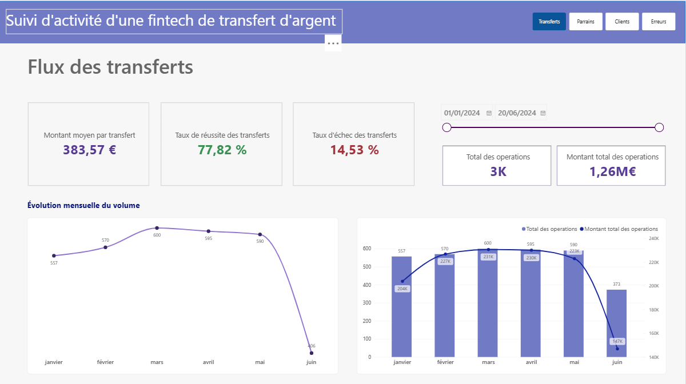
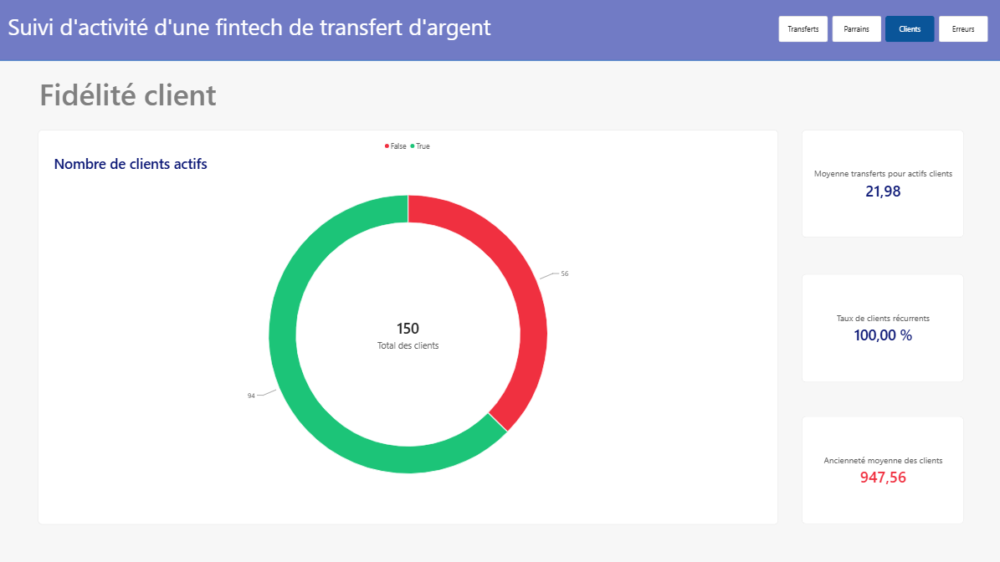

# 📊 Power BI – Data Analyst Portfolio

## Présentation

Ce repository présente deux projets réalisés avec **Microsoft Power BI** dans le cadre de ma formation **Data Analyst**.

Ces projets m'ont permis de mettre en pratique l'analyse de données, la création de KPI, la visualisation de données et la conception de dashboards interactifs.

---

# 📌 Projet 1 — Analyse des ventes

Ce dashboard permet d'analyser les performances commerciales à travers différents indicateurs.

### KPI

| Indicateur | Valeur |
|---|---:|
| Chiffre d'affaires total | 383,20 |
| Total des produits | 185 |
| Moyenne du CA | 5,99 |

### Analyses

- Évolution du chiffre d'affaires dans le temps
- Répartition des produits par catégorie
- Répartition des produits par ville
- Analyse des performances mensuelles
- Filtres temporels interactifs

### Dashboard



---

# 💸 Projet 2 — Suivi d'activité d'une FinTech

Ce dashboard permet de suivre l'activité d'une plateforme de transfert d'argent.

## Flux des transferts

### KPI

| Indicateur | Valeur |
|---|---:|
| Montant moyen par transfert | 383,57 € |
| Taux de réussite | 77,82 % |
| Taux d'échec | 14,53 % |
| Total des opérations | 3K |
| Montant total des opérations | 1,26 M€ |

### Analyses

- Évolution mensuelle du volume des transferts
- Évolution du nombre d'opérations
- Évolution du montant total des opérations
- Comparaison volume / montant
- Analyse temporelle

### Dashboard



---

# 👥 Fidélité client

Cette vue permet d'analyser la fidélité et l'activité des clients.

### KPI

| Indicateur | Valeur |
|---|---:|
| Total des clients | 150 |
| Taux de clients récurrents | 100 % |
| Moyenne des transferts par client actif | 21,98 |
| Ancienneté moyenne | 947,56 jours |

### Dashboard



---

# 🛠️ Technologies

- Microsoft Power BI
- Power Query
- DAX
- Data Visualization
- Business Intelligence
- KPI
- Data Analysis

---

# 🎯 Compétences

Ces projets m'ont permis de développer des compétences en :

- Nettoyage et préparation des données
- Transformation des données avec Power Query
- Analyse exploratoire
- Création de mesures DAX
- Création de KPI
- Data Visualization
- Création de dashboards interactifs
- Analyse des tendances
- Présentation d'indicateurs métier

---

# 📂 Structure

```text
powerbi-data-analyst-portfolio/
│
├── README.md
│
├── screenshots/
│   ├── analyse-des-ventes.png
│   ├── flux-des-transferts.png
│   └── fidelite-client.png
│
└── powerbi/
    └── README.md
